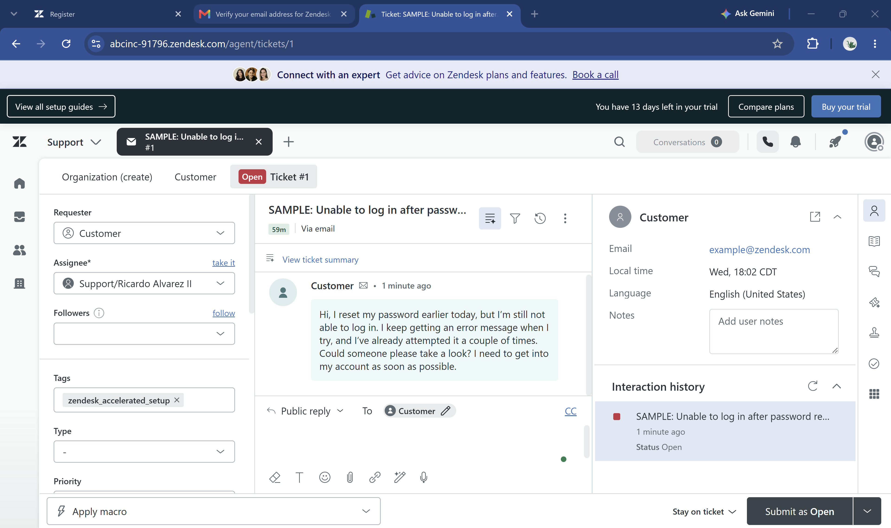
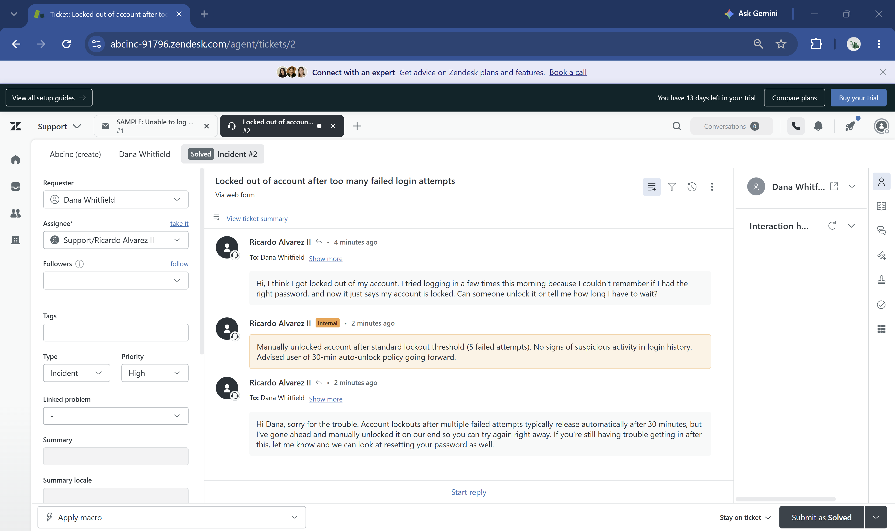
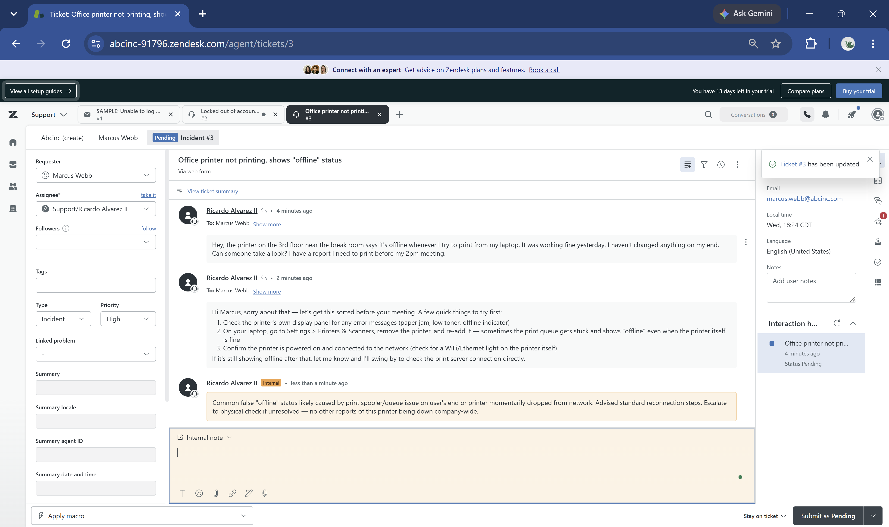
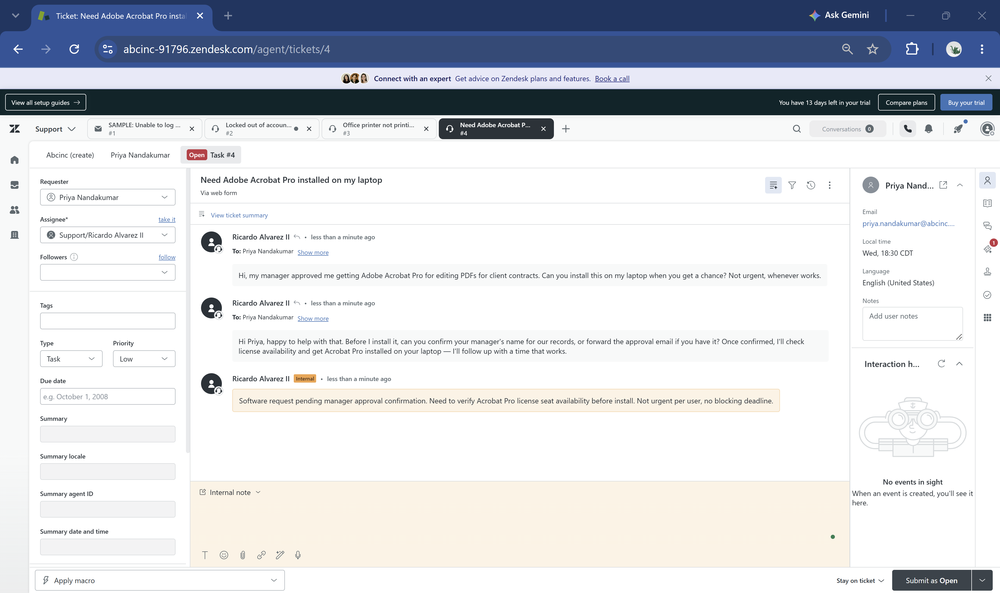
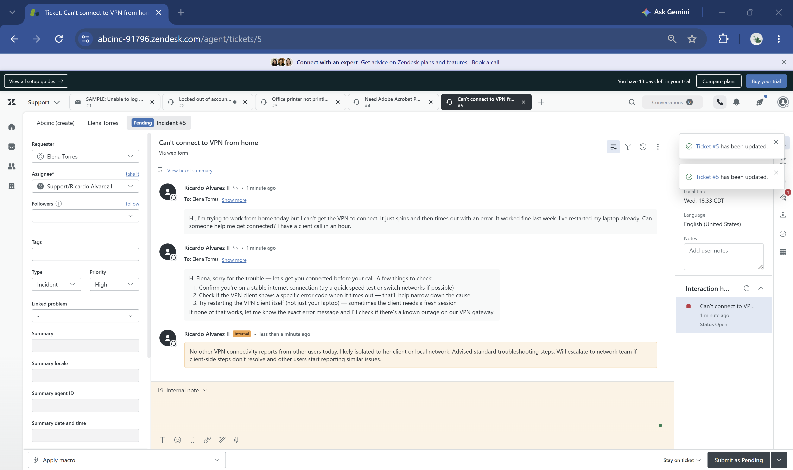
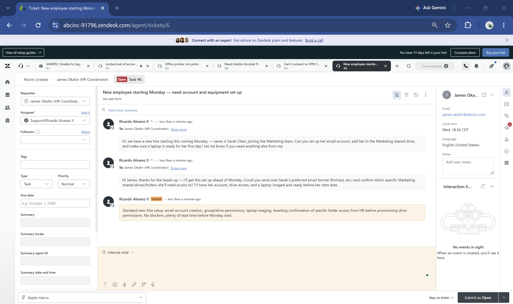
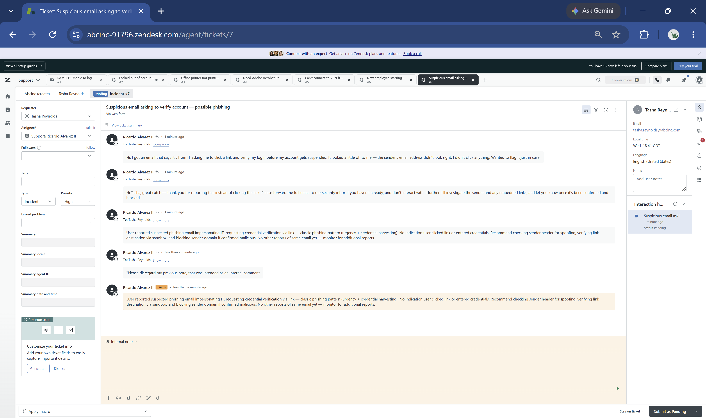

# IT Support Helpdesk Simulation

A simulated IT help desk environment built in Zendesk to develop hands-on experience with real-world ticketing workflows — intake, triage, internal documentation, and resolution — ahead of applying to entry-level IT support and help desk roles.

## Why This Project Exists

I have a cybersecurity background (BBA in Cybersecurity, Security+, hands-on SOC/security lab experience) but no professional help desk or ticketing system experience. This project closes that gap by giving me real, hands-on exposure to a ticketing platform and the day-to-day workflow of a support analyst, so I can speak credibly about it in interviews rather than just in theory.

**This is a self-built simulation, not real employer or customer support experience.** Every ticket below was created and worked by me, playing both the requester and the support agent, to practice realistic triage and documentation habits.

## Tools Used

- **Zendesk** (trial instance) — ticketing platform
- Ticket fields: Type (Incident/Task), Priority (Low/Normal/High/Urgent), public replies, internal notes, status tracking (Open/Pending/Solved)

## What I Practiced

- Triaging incoming tickets and assigning appropriate type/priority
- Writing clear, professional customer-facing responses
- Documenting internal reasoning and next steps in internal notes (distinct from customer replies)
- Managing ticket status through a full lifecycle (Open → Pending → Solved)
- Correcting a real mistake mid-workflow (see Ticket 7) — caught an internal note that was accidentally sent as a public reply, and followed up transparently

## Ticket Summary

| # | Subject | Type | Priority | Status | Scenario |
|---|---------|------|----------|--------|----------|
| 1 | Unable to log in after password reset | Incident | High | Solved | Login/access troubleshooting |
| 2 | Locked out of account after too many failed login attempts | Incident | Normal | Solved | Account lockout, manual unlock |
| 3 | Office printer not printing, shows "offline" status | Incident | High | Pending | Hardware/network troubleshooting |
| 4 | Need Adobe Acrobat Pro installed on my laptop | Task | Low | Open | Software install request |
| 5 | Can't connect to VPN from home | Incident | High | Pending | Remote access troubleshooting |
| 6 | New employee starting Monday — need account and equipment set up | Task | Normal | Open | New-hire account provisioning |
| 7 | Suspicious email asking to verify account — possible phishing | Incident | High | Pending | Phishing report / security triage |

## Screenshots

### Ticket Queue Overview

### Ticket 1 — Login Issue

### Ticket 2 — Account Lockout (Solved)

### Ticket 3 — Printer Offline

### Ticket 4 — Software Install Request

### Ticket 5 — VPN Connectivity Issue

### Ticket 6 — New Hire Setup

### Ticket 7 — Phishing Report

## Key Takeaway

I wanted hands-on experience with a real ticketing system instead of waiting for a job to give me that opportunity, so I built this simulation myself. It's not a replacement for real help desk experience, but it means I can speak to ticketing workflows from firsthand practice instead of just theory.
